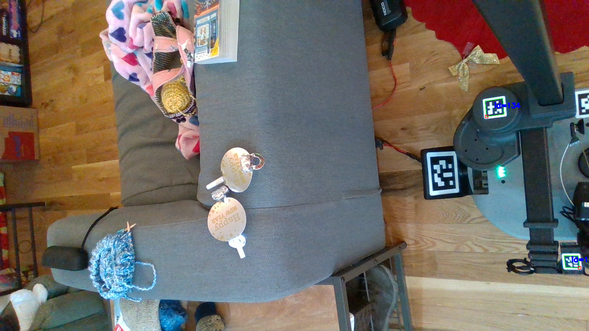

# Aruco Detection



The frames collected in this folder are frames captured by the head depth camera, a Realsense D435if. Each frame includes:

 - A color image
 - A depth image
 - A color camera info dictionary
 - A depth camera info dictionary
 - The detection results

The depth scale value will be the following:

```
depth scale: 0.0010000000474974513
```

Each camera info dictionary follows the following structure:

```
{
    'camera_matrix': array([[380.38308716,   0.        , 321.31900024],
                            [  0.        , 380.38308716, 237.94313049],
                            [  0.        ,   0.        ,   1.        ]]),
    'distortion_coefficients': array([0., 0., 0., 0., 0.]),
    'distortion_model': <distortion.brown_conrady: 4>
}
```
