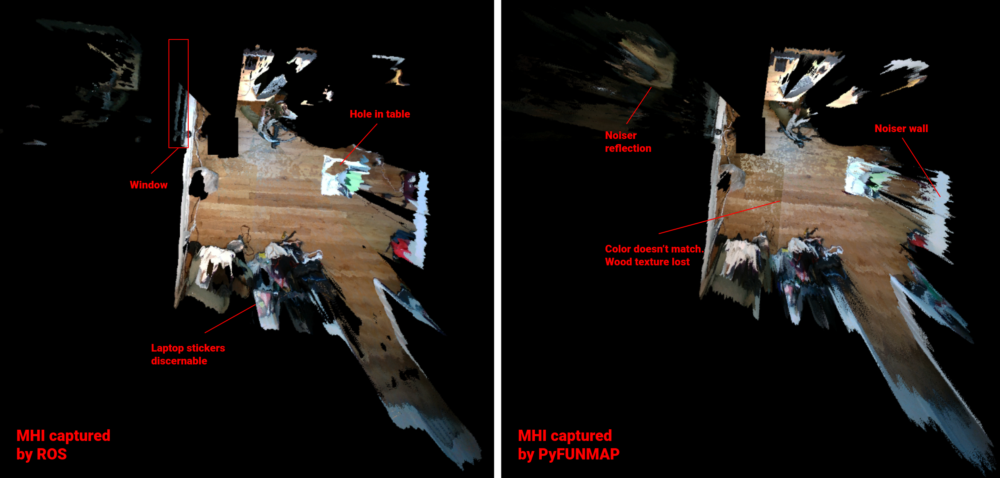

# Head Scanning Experiments

The two sets of Max Height Image (MHI) files in this folder were captured by the `HeadScan` class with two sources of point cloud data. The point clouds come from the same camera, but the ROS MHI uses realsense_ros and ros_numpy to create the point cloud, whereas the PyFUNMAP MHI uses the pyrealsense2 library and its own algorithm to create the point cloud. The scanning algorithm in `HeadScan` is indentical and the robot's position is unchanged. The comparison above shows the differences in the RGB component of the MHI. The ROS scan seems to have cleaner data (i.e. more discernable detail, less depth noise in further away points), but the PyFUNMAP scan seems to be more complete (i.e. holes in the ROS scan are not present in this one).