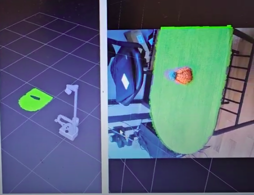

# Segment Objects Experiments



The pickle files in this folder were captured by having the [grasp_object demo from Stretch ROS](https://github.com/hello-robot/stretch_ros/blob/noetic/stretch_demos/nodes/grasp_object) dump their manipulation view. They are `ManipulationView` (from the `stretch_pyfunmap.manipulation_planning` module) instances and can be loaded as:

```python
with open('manip_found.pkl', 'rb') as inp: 
    manip_found = pickle.load(inp)
```

`manip_found.pkl` was captured while a table with a single plush toy was set before the camera, and calling `stretch_pyfunmap.segment_max_height_image.find_closest_flat_surface()` on it does find a surface. `manip_nofound.pkl` doesn't find a surface. The image seems to be entirely empty for some reason. `manip_two.pkl` has two objects on the table.